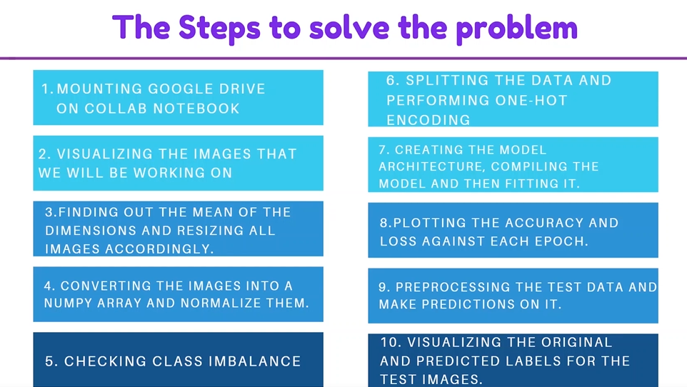
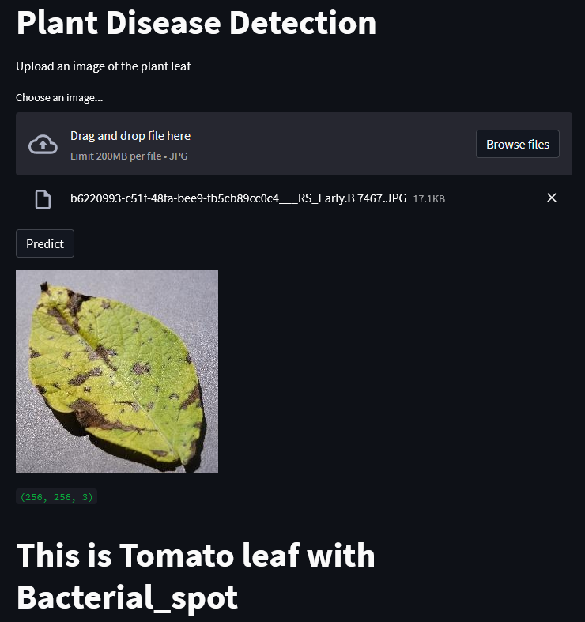

In this project, we have created a Convolutional Neural Network which is able to predict whether a plant is suffering from a disease. We have used different layers and other hyperparameters for building, training and testing this classifictaion model. We have used tensorflow and keras for this project.

# Installation

- 1 - create a virtual environment and activate
- 2 - pip install virtualenv
- - virtualenv envname
- - envname\scripts\activate
- 3 - cd into project
- 4 - pip install -r requirements.txt
- 5 - streamlit run main_app.py

# Steps

# HomePage

